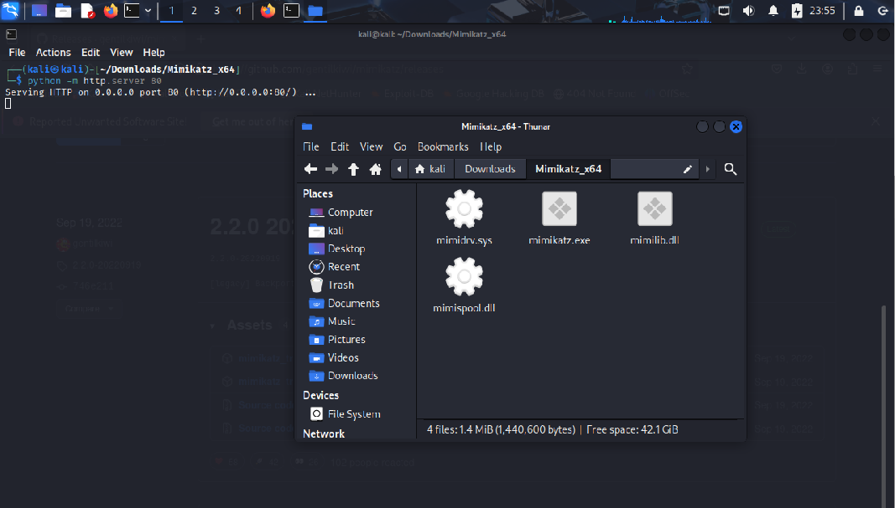
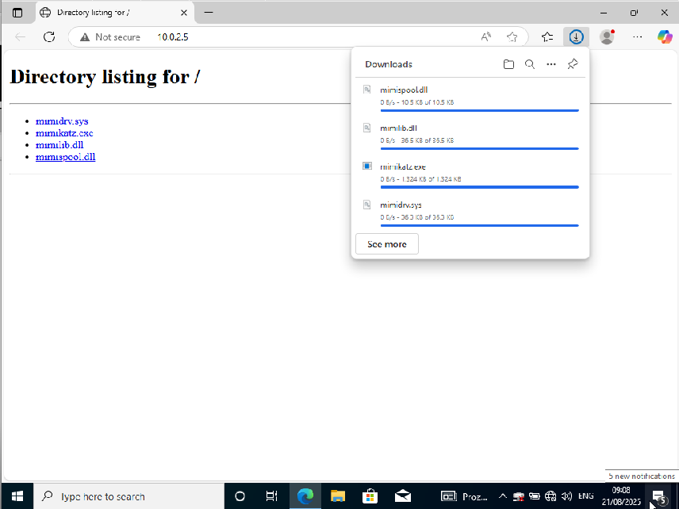
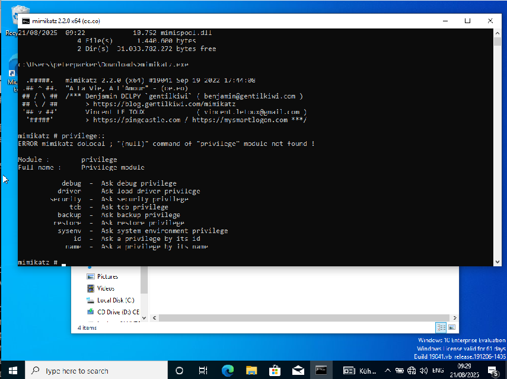
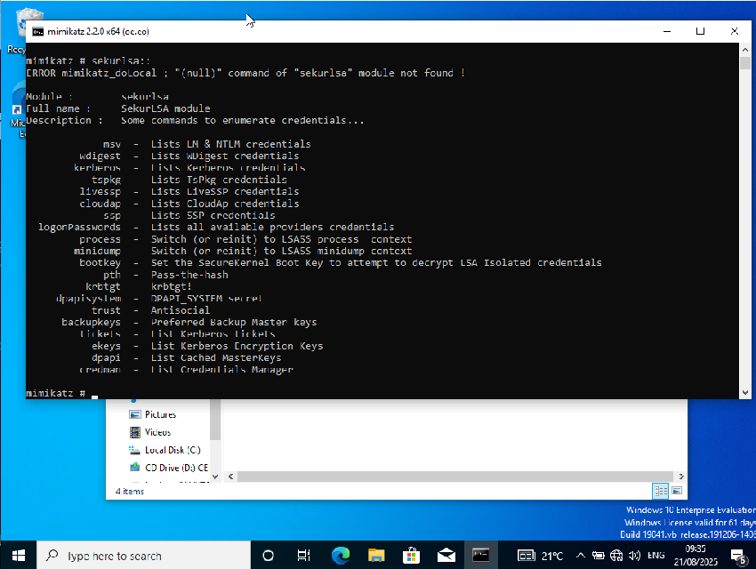
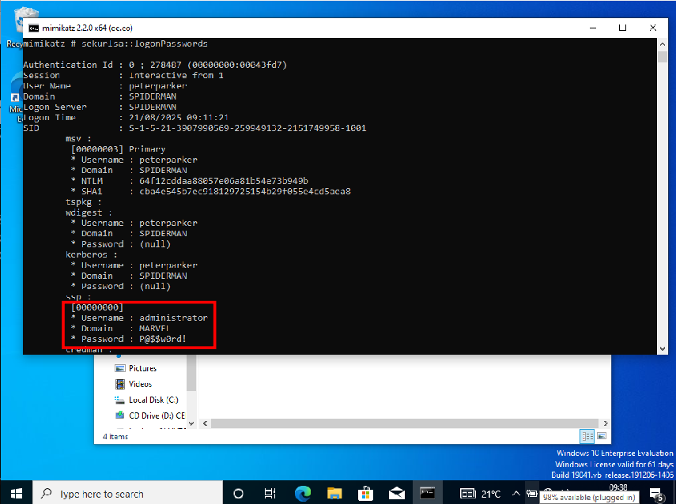

# Credential Dumping with Mimikatz

We start the `SPIDERMAN` machine of our lab environment and make sure that we

Next, we download one of the `mimikatz_trunk` files from this
[github repo](https://github.com/gentilkiwi/mimikatz/releases), which is not
maintained any more since 2022. We extract the files in the x64 folder in the
compressed file and store them somewhere on our Kali machine. To get them to
the Windows machine, we can just spin up an HTTP server with `python -m
http.server 80` from within the folder where the `mimikatz` files are stored.

We can then go to our `SPIDERMAN` machine, open a web browser and navigate to
our Kali machine's IP address (`10.0.2.5`). We "just click" on the four files
to download them to the Windows machine. The download does not work at first
unless we switch off antivirus protection on `SPIDERMAN`, otherwise the
software is identified as malicious.

We then open a `cmd` prompt with administrator rights and move to the downloads
folder with `cd c:\users\peterparker\downloads` and start `mimikatz.exe` from
the command prompt. We set enter `privilege::debug` to switch to debug mode and
can then start to run different attacks.

With `sekurlsa::` we can get a list of options for the `SekurLSA` module. A lot
of these can already be retrieved with `secretsdump.py`, but some functions are
new and helpful, e.g. `sekurlsa::logonPasswords`.

This already gives us the domain admin password in clear text! This is possible
because we have stored the access credentials for the file share `hackme`, the
domain admin's password, in the `credman`, the credential manager. Besides this
clear text password, we can also find `NTLM` hashes.

Punchline: `mimikatz` is usually detected by antivirus software unless it is
heavily obfuscated, but if we have the chance to run it, it is very powerful
and gives us quick access to valuable access credentials.

### Further reading

* [Ein umfassender Leitfaden zu Mimikatz: Was Sie wissen müssen](https://www.sectepe.de/glossar/leitfaden-mimikatz)
* [Detailed mimikatz guide](https://medium.com/@redfanatic7/detailed-mimikatz-guide-87176fd526c0)

<!--
span style="color:green;font-weight:700;font-size:20px">
markdown color font styles

