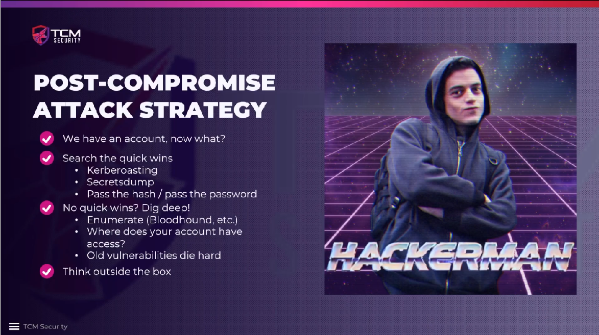

# Post-Compromise Attack Strategy

We should be looking for **quick wins**. **Kerberoasting** is one of the first
things, because we can dump the password hashes and start cracking them while we
work on something else. We do not need to get a shell on a machine unless we are
desperate. Instead, we can **dump the secrets** of a machine and pass the
passwords and hashes around to see where they work. Repeat the same steps all over
again: dump secrets and spray them to see if we can move laterally or vertically.
If none of this works, we have to dig deeper and **enumerate the network** with
`Bloodhound` to see where the valuable machines and accounts are. Check
everything that we have access to with our account, e.g. emails or file shares.
**Old vulnerabilities** are often still unpatched and can still be exploited.

**Things to research:** Certificate attack and the tool `certipy` could be
helpful.

<!--
span style="color:green;font-weight:700;font-size:20px">
markdown color font styles

