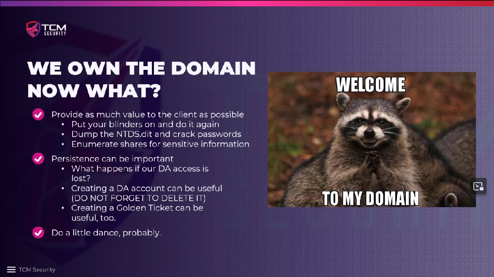

# Post-Domain Compromise Attack Strategy

If we have already gotten control of a domain admin account and we still have
time left in our engagement we should look for alternative routes to gain
control over the domain. We should also get hold of the NTDS database and try
to crack as many passwords as possible, and we should try to find sensitive
information on shares, etc. that is either easy to retrieve for attackers or
that does not have to be on the network in the first place (PII = personally
identifiable information).

We should create a temporary domain admin (DA) account to have persistence for
us, even if a domain admin notices that we have compromised their account and
changes a password. Furthermore, there should be detection that highlights to
the regular domain admins if a new domain admin account is created. It is very
important to **delete the account** when the engagement is finished, especially
to avoid weak passwords on newly created accounts!

<!--
span style="color:green;font-weight:700;font-size:20px">
markdown color font styles

