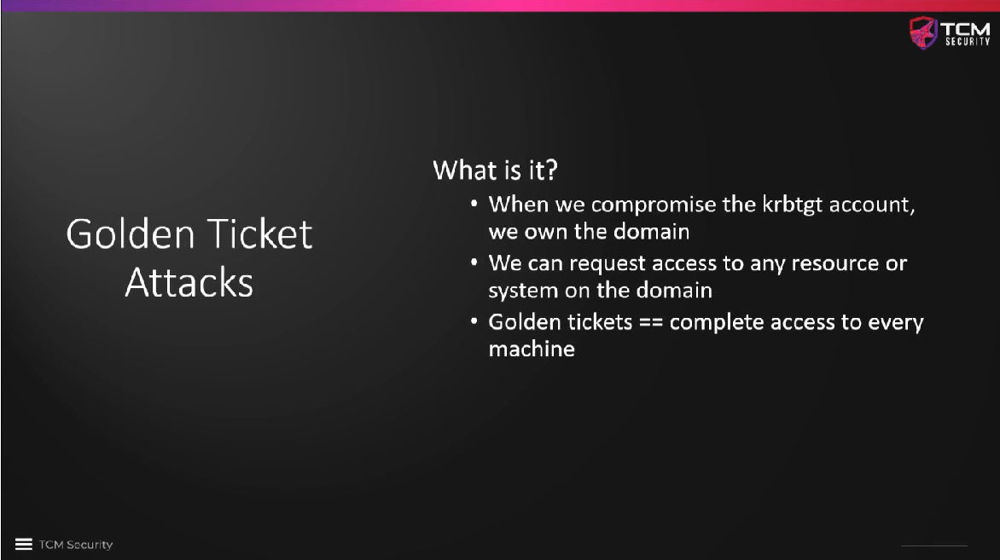
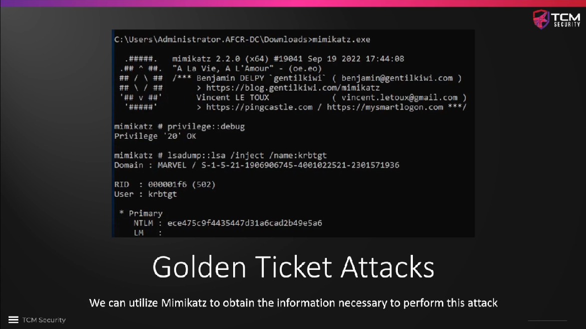
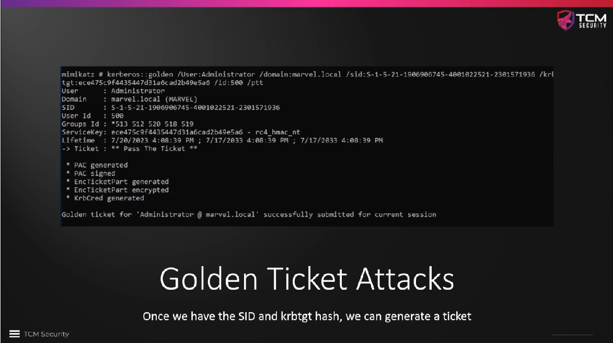
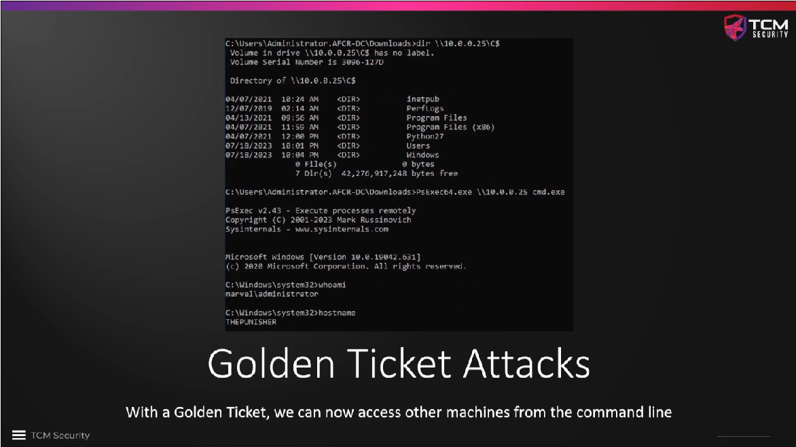

# Golden Ticket Attacks Overview

When we compromise the `krbtgt` acount, we own the domain. `krbtgt` is an
abbreviation for `Kerberos ticket-granting ticket`. We can use the account to
grant ourselves access to any account or machine on the domain, which makes us
own the domain.

We can use `Mimikatz` to carry out an **LSA dump** with `privilege::debug`. We
need to get hold of the `NTLM hash` of the `krbtgt` account, and we need to get
the `domain SID`.

Once we have both, we can generate a **Golden Ticket**.

Once we have generated this ticket, we can use **Pass the Ticket** to use it
everywhere on the domain. For example, we can open a new command prompt from
anywhere and access any machine in the domain. In the example below, TCM has
listed the contents of the `C:\` drive of a remote machine. One can also use a
command like `PsExec64` to get a shell on that remote machine.

To carry out the Golden Ticket Attack, we need to move `Mimikatz` to the domain
controller first, e.g. by starting a **Python web server** on another machine
and downloading the necessary files from there to the domain controller.

### Further reading

* [Golden Ticket Attack: What It Is and How to Defend](https://www.crowdstrike.com/en-us/cybersecurity-101/cyberattacks/golden-ticket-attack/)
* [Kerberos und das Golden Ticket – Der IT-Security-Super-GAU](https://www.dr-datenschutz.de/kerberos-und-das-golden-ticket-der-it-security-super-gau/)
* [Golden Ticket Attack Explained - MITRE ATT&CK T1558.001](https://www.picussecurity.com/resource/blog/golden-ticket-attack-mitre-t1558.001)
* [Detecting a Kerberos Golden Ticket Attack](https://www.sentinelone.com/blog/mitigation-strategy-kerberos-golden-ticket-attack/)

<!--
span style="color:green;font-weight:700;font-size:20px">
markdown color font styles

