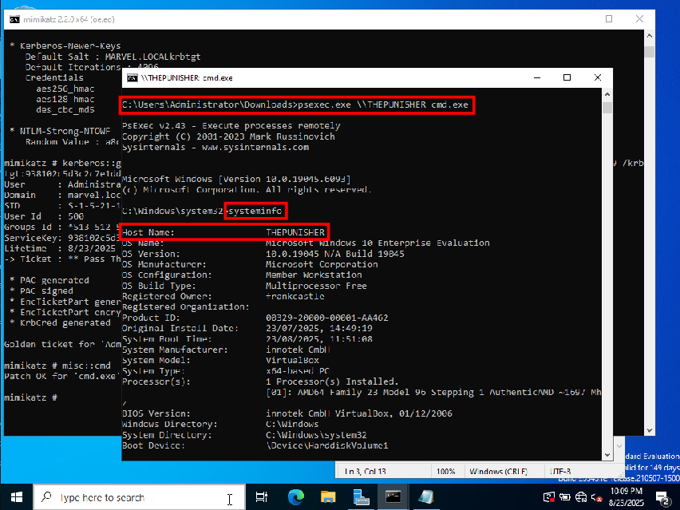

# Golden Ticket Attacks

With a Kerberos Ticket-granting Ticket (`krbtgt`) we can request access to any
ressource and machine on the domain using the ticket-granting service. We can
get shells on all of the machines and access all files and folders.

After starting `mimikatz.exe`, we enter `privilege::debug` followed by
`lsadump::lsa /inject /name:krbtgt` using the `name` parameter to make sure
that we only pull data on the user `krbtgt`.


We copy the `SID (S-1-5-21...)` and the `NTLM (9381...)` hash into a notepad
file. We do not need the other information.

The command to retrieve the Golden Ticket is

```
kerberos::golden /User:Administrator /domain:marvel.local /sid:S-1-5-21-1489142520-1265584170-3633136899 /krbtgt:938102c5d3c2c7e1ddc0ed42952f52d2 /id:500 /ptt
```

The option `user` can be filled with any value, even such that do not exist.
The `domain` has to be set to the correct value, and the `sid` and `krbtgt`
options have to be filled with the `SID` and `NTLM` hash values that we have
pulled from the domain controller in the previous step. The `id` of 500 stands
for an administrator account, `ptt` stands for `pass the ticket`. The latter
means that the generated Golden Ticket is passed to the current session. We
will open a command prompt in the next step from which we can access any
computer we want.


We can now open said command prompt with `misc::cmd`. This opens a new window
with a regular `cmd` command prompt.


We can now use the Windows tool `psexec.exe`, which has been created to run
shell commands remotely on other machines, provided that it is run from an
administrator account. We are running the shell with admin rights right now, so
we can use the program once we have downloaded it to the domain controller. One
can download a `zip` file with several tools from the `Microsoft` website,
extract `psexec.exe` and `psexec64.exe` and transfer them to the domain
controller again via an HTTP server in Python. To open a remote shell on
`THEPUNISHER` we use the command `psexec.exe \\THEPUNISHER cmd.exe` and get a
command prompt with full admin rights on `THEPUNISHER`. This works in an
analogous manner for all machines in the domain. We have full access now!



On top of the full control, the Golden Ticket also gives us persistence. As a
domain admin, we can simply create a new user and make it a domain admin. Many
defensive teams will notice that, so it bears a risk of detection. The Golden
Ticket as such is noticed less frequently. Since Golden Tickets are picked up
too often, the **stealthier Silver Ticket** is now becoming more popular now.

**Challenge:** Play around with `psexec.exe`, learn more `mimikatz` commands.
We have the lab environment ready built for it!


### Further reading

* [Security identifiers](https://learn.microsoft.com/en-us/windows-server/identity/ad-ds/manage/understand-security-identifiers)
* [Difference between a RID and a SID in Active Directory](https://morgantechspace.com/2013/10/difference-between-rid-and-sid-in.html)
* [Domain Persistence: Golden Ticket Attack](https://www.hackingarticles.in/domain-persistence-golden-ticket-attack/)
* [Golden Ticket](https://pentestlab.blog/2018/04/09/golden-ticket/)
* [Domain Persistence – Golden Ticket and Silver Ticket Attacks](https://juggernaut-sec.com/domain-persistence-golden-ticket-and-silver-ticket-attacks/)
* [Was ist PSExec und wie benutzt man es richtig?](https://www.dirks-computerecke.de/anleitungen/psexec-anleitung.htm)
* [PsExec v2.43](https://learn.microsoft.com/de-de/sysinternals/downloads/psexec)


<!--
span style="color:green;font-weight:700;font-size:20px">
markdown color font styles
</span
-->
