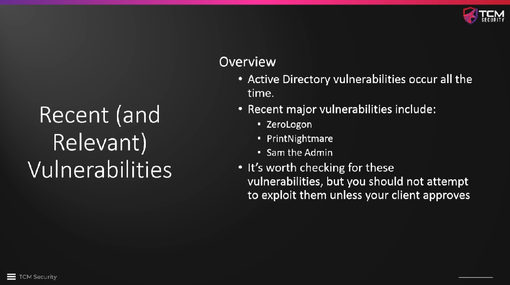

# Section Overview

We should always check for recently discovered vulnerabilities of Active
Directory, which are discovered all the time. However, we should also make sure
that the exploits do not bear the risk of taking down the domain permanently or
that they cause severe problems in our customer's network.

**ZeroLogon** is a vulnerability that bears this risk, therefore we should only
use available scanners to test whether the domain is vulnerable to this attack,
but not actually carry it out. Other recent attacks can be carried out, but we
should perhaps inform our client about our plans.

"Recent attacks" refers to the last 5 years or so, not just the last 6 months.
Many people do not update their infrastructure so quickly.

<!--
span style="color:green;font-weight:700;font-size:20px">
markdown color font styles

